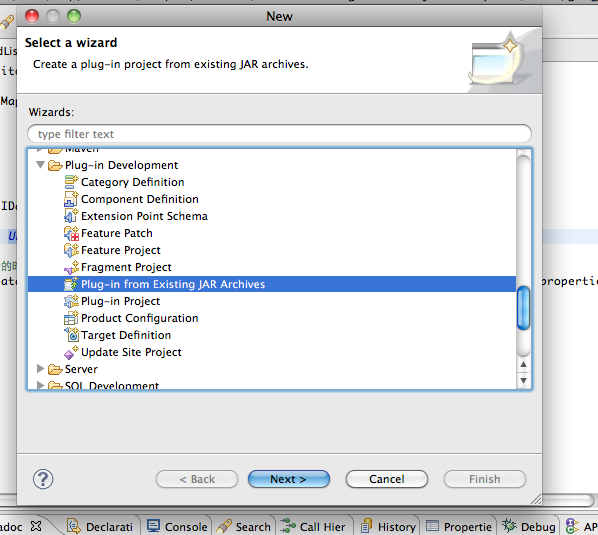

Gemini控制台
============
:作 者: Jet Geng
:日 期: 2011-07-22
概述
----------
在 *Blueprint* 起步中我们已经成功的通过 *Blueprint* 容器创建了一个POJO。我们只是通过log的方式查看到我们的POJO已经被创建了。无法深入的去了解容器内部Bean的运行状态和行为。
所以才有必要创建一个Gemini控制台这样的程序。这个控制台最初的需求是：
 - 能够动态查看特定的Bean是否被创建。
 - 能够动态的获取特定的Bean。
 - 能够检查特定Bean的行为是否正确。

解决方案
-------------
为了解决以上的问题。我做了一个小工具。 这个小工具的目的让客户的动态脚本能在最终的目标环境中运行。使用方式如下：
 1. 从 git://github.com/jetgeng/OSGi.git 下载 **org.gunn.gemini.console** 和 **org.codehaus.groovy** 这两个项目。
 #. 并把这两项目加入到你的TargetPlatform中。
 #. 使用 **invokegv** 来运行groovy脚本。

    1) 直接在命令行输入脚本。例如： ``invokegv print act.getBean(''myPOJO'')``

    2) 通过输入Groovy文件。例如： ``invokegv file:///Users/Puer/.../script.groovy``

.. note::
    在Groovy脚本中有一个内建的变量 **act** ， 他又一个叫做 **getBean** 的方法。通过这个方法你可以获得当前 **OSGi** 平台中所有的BlueprintContainer中的组件。他的输入参数时Bean或Service的id。
    如果是使用Groovy文件的形式，注意文件的url格式。他是通过如下的正则表达式 ``file:\\/{2}(\\/[:\\w\\.]+)+`` 进行验证的。并且路径中暂时不支持中文。

这个周末(23或24日)完成一个简单的录屏，来演示这个小工具的使用。

问题
----------
现在这种方式不能获取到 **OSGi** 中的类。会报出ClassNotFound异常。
这个是在主干支里出现的代码。如何处理。
这个地方，我应该使用自己的 **ClassLoader** 来自定义Class的寻找，保证能够找到真确的类。
.. _Emacs: http://www.gnu.org/software/emacs/
.. _ScriptEngine: http://www.ibm.com/developerworks/cn/java/j-lo-jse6/
.. _Groovy: http://groovy.codehaus.org/

